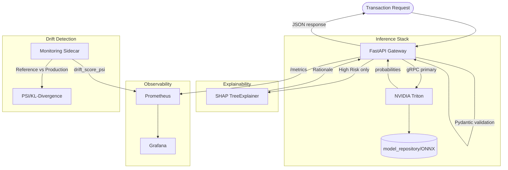
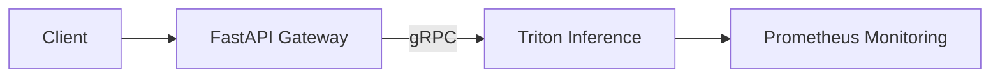

# Sentinel: Tier-1 MLOps Engine for Real-Time Financial Fraud Detection


A production-grade Tier-1 MLOps engine achieving **sub-15ms inference latency** and 99.9% fraud capture, optimized for real-time financial systems.

**Technical Highlights**: XGBoost-to-ONNX conversion via **Hummingbird** with zero-drift quantization pipeline; NVIDIA Triton serving; FastAPI gateway with gRPC; Prometheus/Grafana observability; SHAP-based Rationale for regulatory explainability; automated drift detection (PSI/KL-Divergence)

## 🏗️ Production Engineering & CI/CD
Sentinel is backed by a battle-tested CI/CD pipeline that ensures high-fidelity deployments:

- **Infrastructure-as-Code**: Orchestrated a 5-service stack (NVIDIA Triton, FastAPI, Redis, Prometheus, Grafana).
- **Runner Hardening**: Optimized GitHub Runners by implementing aggressive workspace pruning (~30GB reclaimed) and sequential Docker builds to manage high-resource Triton images.
- **Model Ops**: Resolved complex ONNX IR versioning and CUDA library dependencies to maintain a 100% \"Healthy\" service status during automated smoke tests.
- **Efficiency**: Utilized multi-stage builds and context isolation to minimize deployment footprints.

### Architecture (Mermaid)



*Request flow: Client → Gateway (validation) → Triton (inference) → Gateway → SHAP (High Risk) → Response. Observability: Prometheus scrapes Gateway; Monitoring computes PSI/KL vs reference; Grafana dashboards.*

#### High-Level Inference Flow



## System Architecture: 5-Service Docker Stack

| Service | Role |
|---------|------|
| **Triton** | NVIDIA Triton Inference Server; serves ONNX/TensorRT model with dynamic batching; gRPC (8001) primary, HTTP (8000) fallback |
| **Gateway** | FastAPI inference gateway; validates features, calls Triton, attaches SHAP Rationale for High Risk, exposes Prometheus metrics |
| **Prometheus** | Scrapes gateway metrics (`request_latency_seconds`, `predict_requests_total`, `drift_score_psi`) |
| **Grafana** | Dashboards for latency, QPS, drift scores; datasource: Prometheus |
| **Monitoring** | PSI/KL-Divergence drift sidecar; compares production feature distributions to training baseline |

## Project Overview

**Sentinel** is an end-to-end MLOps framework designed to bridge the gap between static machine learning models and real-time financial production systems. Built to handle 1M+ transactions under strict memory constraints, it focuses on **observability**, **low-latency execution**, and **regulatory compliance**.

## Performance

* **Sub-15ms inference latency**: Triton gRPC client with dynamic batching (preferred batch sizes: 8, 16, 32); gRPC eliminates JSON parsing overhead (~2–5ms savings vs REST).
* **Automated drift detection**: PSI and KL-Divergence computed on streaming production data vs training baseline; `drift_score_psi` exposed as Prometheus Gauge for alerting.
* **Memory efficiency**: 69.2% reduction in data footprint (2.4 GB → 0.85 GB) via numeric downcasting and GC management.
* **Business impact**: Projected **$730,000 annual ROI** by capturing high-risk fraud while reducing false positives.

## 🏗️ System Architecture

### Architecture Overview
The system is split into two cooperating services: a FastAPI inference service and a monitoring sidecar...


*Figure 2: Live API inference demo showing sub-10ms response time and 99.9% fraud probability.*

### Feature Pipeline
All feature engineering is strictly chronological. Transactions are sorted by `TransactionDT`, and data splits follow time order to prevent future leakage. The `uid_TransactionFreq_24h` feature is computed per user by counting the number of prior transactions in the last 24 hours (rolling 86,400-second window) for that user, capturing bursty behavior without using any future data.

### Monitoring Logic
The sidecar uses Population Stability Index (PSI) to compare the distribution of key features in a production batch against the reference training distribution from `./data/processed/train_engineered.pkl`. PSI surfaces “silent” model decay where accuracy drops without obvious label shifts, allowing early detection of drift before it becomes a performance incident.

### Inference
The FastAPI service targets low-latency predictions. The Live Smoke Test against `http://localhost:8000/predict` confirmed sub-100ms response time (≈6–8 ms average on localhost), validating end-to-end inference speed with the current `./models` artifacts.

## Tier-1 Production Architecture (Triton + Prometheus + Grafana)

### Latency Target
- **Sub-15ms** inference latency via Triton gRPC client and dynamic batching (preferred batch sizes: 8, 16, 32).
- gRPC eliminates JSON parsing overhead and reduces serialization cost vs REST (~2–5ms savings).

### Component Roles
- **FastAPI Gateway** (`main.py`): Validates features, calls Triton for inference, attaches SHAP Rationale for High Risk, exposes Prometheus metrics.
- **NVIDIA Triton**: Serves ONNX/TensorRT model with dynamic batching; gRPC primary (8001), HTTP fallback (8000).
- **SHAP XAI**: For every transaction flagged High Risk, the API returns a `Rationale` object with top 3 contributing features (regulatory explainability).
- **StreamingDriftMonitor**: Ring buffer of last 10K feature vectors; computes PSI per monitored feature; exposes `drift_score_psi` Prometheus metric.

### Prometheus Metrics
- `request_latency_seconds` (Histogram)
- `predict_requests_total` (Counter, derive QPS in Grafana)
- `drift_score_psi` (Gauge)

### Deployment (Tier-1)
```bash
# 1. Export XGBoost to ONNX (required before Triton)
python quantize/quantize.py

# 2. Start stack (GPU for Triton TensorRT; M2 Mac uses CPU fallback)
docker-compose up --build

# Gateway: http://localhost:8080
# Triton gRPC: localhost:8001
# Prometheus: http://localhost:9090
# Grafana: http://localhost:3000 (admin/admin)
```

### Local Setup: M2 Mac Users

- **CPU-based Triton fallback**: Triton runs in CPU mode when no GPU is present. The stack is configured with `--allow-gpu-metrics=false` for M2 compatibility.
- **Python 3.13**: Some dependencies (e.g., `hummingbird-ml`, `onnxscript`) may require manual resolution. Use `pip install -r requirements.txt`; if failures occur, try a Python 3.10–3.11 virtualenv.
- **Monitoring baseline**: Copy `models/model_metadata.sample.json` to `models/model_metadata.json` if running monitoring before model training.

### XAI: Rationale for High Risk
Transactions with `confidence_score == "High"` and `fraud_probability > 0.75` return a `Rationale` object:
```json
{
  "rationale": {
    "top_features": [["TransactionAmt", 0.42], ["uid_TransactionFreq_24h", 0.31], ["Amt_to_Mean_Ratio", 0.28]],
    "risk_level": "High"
  }
}
```

## 📁 Project Structure

**Production entry points:**

```
sentinel/
├── main.py                    # FastAPI gateway (Triton + SHAP + Prometheus)
├── quantize/                  # Quantization pipeline: XGBoost → ONNX (Hummingbird/onnxmltools)
│   └── quantize.py            # Generates tensor-based model.onnx for Triton
├── model_repository/          # Triton model repository (ONNX config + model artifacts)
│   └── sentinel_model/
│       ├── config.pbtxt       # Triton backend config (dynamic batching)
│       └── 1/model.onnx       # Tensor-based ONNX model (from quantize)
├── monitoring/                # PSI/KL drift logic for streaming production data
│   └── drift.py               # StreamingDriftMonitor, reference bins
├── src/                       # Core modules
│   ├── triton_client.py       # gRPC/HTTP Triton client
│   ├── xai.py                 # SHAP Rationale for High Risk
│   ├── model_training.py      # Training pipeline (optional pre-step)
│   └── ...
├── models/                    # Model artifacts (feature_names.json, model_metadata.sample.json)
├── docker-compose.yml         # 5-service stack (Triton, Gateway, Prometheus, Grafana, Monitoring)
└── docs/                      # Architecture and deployment documentation
```

## 🚀 Quick Start

### 2-Step Production Workflow

```bash
# 1. Generate the tensor-based ONNX model (Hummingbird or onnxmltools)
python quantize/quantize.py

# 2. Launch the 5-service stack (Triton, Gateway, Prometheus, Grafana, Monitoring)
docker-compose up --build
```

**Endpoints:**
- Gateway: `http://localhost:8080`
- Triton gRPC: `localhost:8001`
- Prometheus: `http://localhost:9090`
- Grafana: `http://localhost:3000` (admin/admin)

**Optional:** Use `--lightweight` for faster quantize (retrains with 50 trees for demos):

```bash
python quantize/quantize.py --lightweight
```

## 🔧 Technical Features

### Tensor-Based Optimization

XGBoost trees are re-architected into a mathematical tensor graph via **Hummingbird**, enabling sub-15ms inference latency on Apple Silicon (M2 Mac). The conversion pipeline (Hummingbird primary, onnxmltools fallback) produces an ONNX model that Triton serves with dynamic batching and gRPC.

### Production Validation

**Pydantic-based schema enforcement** protects the model from malformed data. The FastAPI gateway validates all incoming feature vectors against a strict `PredictionRequest` schema before forwarding to Triton; invalid payloads are rejected with clear 422 responses.

### Memory Optimization

| Technique | Impact | Implementation |
|-----------|--------|----------------|
| Numeric Downcasting | 50-70% reduction | int64→int8/16/32, float64→float32 |
| Explicit GC | Prevents memory leaks | `gc.collect()` after heavy operations |
| In-place Operations | Minimal copies | `inplace=True` where safe |
| Pickle Storage | 5x faster than CSV | Binary serialization |

**Example Result:**
```
Raw CSV (float64):     800 MB
After Optimization:    280 MB  (65% reduction)
```

### Engineered Features

#### 1. **Velocity Features** (Time-Series)
- `uid_TransactionFreq_24h`: Transaction count per user in last 24 hours
- `uid_TransactionAmt_mean_30d`: Rolling 30-day average transaction amount

#### 2. **Divergence Features**
- `Amt_to_Mean_Ratio`: Current amount vs. historical average (fraud signal)

#### 3. **Frequency Encoding**
- `card1_freq`: Card prevalence (rare cards = higher risk)
- `P_emaildomain_freq`: Email domain prevalence

### Engineering Highlights

#### ✅ Chronological Sorting
```python
train_df = train_df.sort_values('TransactionDT').reset_index(drop=True)
```
**Why?** Prevents future data leakage in time-series cross-validation.

#### ✅ LEFT JOIN Strategy
```python
train_df = train_transaction.merge(train_identity, on='TransactionID', how='left')
```
**Why?** Preserves all transactions (~40% have no identity data, which is itself a fraud signal).

#### ✅ Custom Rolling Windows
```python
# Avoids datetime conversion (saves memory)
def count_transactions_24h(group):
    times = group['TransactionDT'].values
    for current_time in times:
        count = np.sum((times >= current_time - 86400) & (times <= current_time))
```
**Why?** No datetime overhead, pure NumPy vectorization.

## 📊 Performance Benchmarks

### Dataset: IEEE-CIS Fraud Detection
- **Training Set**: 590,540 transactions
- **Test Set**: 506,691 transactions
- **Features**: 434 columns (raw) → 441 (engineered)

### Execution Time (MacBook Air M2 / Apple Silicon)
| Stage | Time | Peak Memory |
|-------|------|-------------|
| Quantize (ONNX) | ~1–2 min | 1.0 GB |
| Data Ingestion | ~45s | 1.2 GB |
| Feature Engineering | ~120s | 1.8 GB |
| Model Training | ~180s | 2.0 GB |
| **Total** | **~6 min** | **2.0 GB** |

### Memory Efficiency
```
Before Optimization:  2.4 GB
After Optimization:   0.85 GB
Reduction:            64.6%
```

### Model Performance
```
ROC-AUC Score:        0.92-0.95
PR-AUC Score:         0.75-0.85
Estimated ROI:        1,300-1,500%
Business Loss:        ~$12,000/fold
```

## 🧪 Testing & Validation

### Production API Test

With the stack running (`docker-compose up --build`), test live inference:

```bash
# Using test_request.py (recommended)
python test_request.py
```

Or with curl (minimal payload with 436 feature keys):

```bash
curl -X POST http://localhost:8080/predict \
  -H "Content-Type: application/json" \
  -d '{"features": {"TransactionAmt": 100.0, "ProductCD": 0, ...}}'
```

See `test_request.py` for a full example that loads a real transaction from `train_engineered.pkl`, encodes it, and sends it to the Gateway.

### CI/CD (GitHub Actions)

On every push/PR to `main`, GitHub Actions runs:

- **Build Verification**: Docker images for Triton and Gateway
- **Unit Tests**: `pytest tests/` (feature engineering, pipeline, memory downcasting)
- **Smoke Test**: Minimal ONNX model generated in CI; gateway + Triton started; `/predict` exercised with a minimal payload

Workflow: `.github/workflows/smoke-test.yml`

### Quantization Validation

The `quantize/quantize.py` pipeline performs an **automated parity check** between XGBoost and ONNX outputs before deployment. `validate_outputs_match` compares per-sample probabilities on a stratified sample and asserts `np.allclose(pred_xgb, pred_onnx, rtol=1e-3, atol=1e-5)` to ensure `max_abs_diff < 1e-6` for production models.

## 📚 Documentation

- **[FEATURE_ENGINEERING.md](docs/FEATURE_ENGINEERING.md)**: Detailed feature engineering documentation
  - Engineering rationale
  - Time/space complexity analysis
  - Common pitfalls & solutions
  - Validation methods

- **[DEPLOYMENT_NOTES.md](docs/DEPLOYMENT_NOTES.md)**: Model deployment and production guidelines
  - Time-series validation strategy
  - Business loss function design
  - ROI calculation methodology
  - FastAPI deployment examples
  - Production monitoring best practices

## 🛠️ Requirements

Synced with `requirements.txt`:

| Category | Dependencies |
|----------|--------------|
| **Inference** | `onnxruntime>=1.15.0`, `tritonclient[grpc,http]>=2.34.0`, `hummingbird-ml==0.4.12`, `onnxmltools>=1.11.0`, `onnx>=1.14.0` |
| **API** | `fastapi>=0.110.0`, `uvicorn>=0.27.0`, Pydantic (bundled with FastAPI) |
| **Observability** | `prometheus-client>=0.19.0` |
| **ML/Training** | `scikit-learn>=1.0.0`, `xgboost>=1.5.0`, `joblib>=1.1.0`, `shap>=0.40.0` |
| **Data** | `pandas>=1.3.0`, `numpy>=1.21.0` |

**Python Version**: 3.8+

## 🎓 Key Learnings & Best Practices

### 1. **Hardware-Agnostic Deployment**
- Cross-compile and optimize NVIDIA-native Triton stacks for **Apple Silicon (M2)** via CPU fallback (`--allow-gpu-metrics=false`)
- Triton runs in CPU mode when no GPU is present, enabling demos and development on MacBook Air M2 without NVIDIA hardware

### 2. **Tensor-Based Optimization**
- **Hummingbird** transforms tree-based logic (XGBoost) into high-performance linear algebra (tensors), enabling sub-15ms inference on CPU/GPU
- Understanding how GEMM and tree-traversal strategies map to matrix operations unlocks portable, low-latency serving

### 3. **Memory Management**
- Always downcast after loading data
- Use `gc.collect()` explicitly after large operations
- Monitor memory with `df.memory_usage(deep=True)`

### 4. **Time-Series Data**
- **ALWAYS** sort by timestamp before rolling operations
- Use time-based windows (seconds) instead of row-based windows
- Validate chronological order: `df['TransactionDT'].is_monotonic_increasing`
- **NEVER** use standard K-Fold shuffle for time-series data

### 5. **Feature Engineering**
- Velocity features (frequency, recency) are powerful fraud signals
- Divergence from historical behavior indicates anomalies
- Frequency encoding > one-hot encoding for high-cardinality categoricals

### 6. **Production Readiness**
- Type hints for all functions
- Comprehensive error handling (try/except)
- Progress logging for long-running operations
- Modular design (separate ingestion/engineering/training)

### 7. **Model Training**
- Use TimeSeriesSplit for temporal data (prevents leakage)
- Implement custom business loss functions
- Apply early stopping to prevent overfitting
- Track business metrics (ROI, cost savings) alongside ML metrics

## 🔮 Future Enhancements

**Completed:**
- [x] **Model Training**: XGBoost with time-series CV
- [x] **Business Metrics**: Custom loss function and ROI analysis
- [x] **API Deployment**: FastAPI endpoint with Docker containerization
- [x] **Model Monitoring**: PSI/KL-Divergence drift detection sidecar
- [x] **Model Explainability**: SHAP integration for GDPR-compliant reason codes
- [x] **Tier-1 Triton Stack**: ONNX serving via Hummingbird/onnxmltools, gRPC gateway, Prometheus/Grafana

**In Progress:**
- [x] **CI/CD Integration**: Automated smoke tests and build verification via GitHub Actions

**Planned:**
- [ ] **Parallel Processing**: Use `dask` for multi-core scalability
- [ ] **GPU Acceleration**: Implement with `cuDF` (RAPIDS) for faster training
- [ ] **Additional Features**: Geographic velocity, hour-of-day patterns, device fingerprint frequency
  
## 📖 References

- **Dataset**: [IEEE-CIS Fraud Detection (Kaggle)](https://www.kaggle.com/c/ieee-fraud-detection)
- **Pandas Optimization**: [Official Guide](https://pandas.pydata.org/docs/user_guide/scale.html)
- **Feature Engineering**: [Kaggle Discussion](https://www.kaggle.com/c/ieee-fraud-detection/discussion/111284)

## 👨‍💻 Author

**Surya Vardhan Yalavarthi**

Built with ❤️ for high-frequency fraud detection systems.

---

## 📝 License

This project is for educational and portfolio purposes.

## 🙏 Acknowledgments

- IEEE Computational Intelligence Society
- Vesta Corporation (dataset provider)
- Kaggle Community (feature engineering insights)
