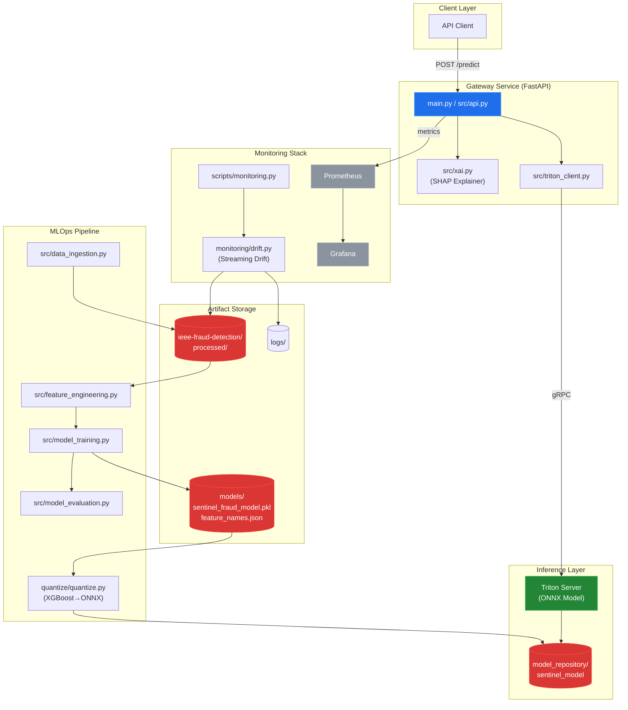
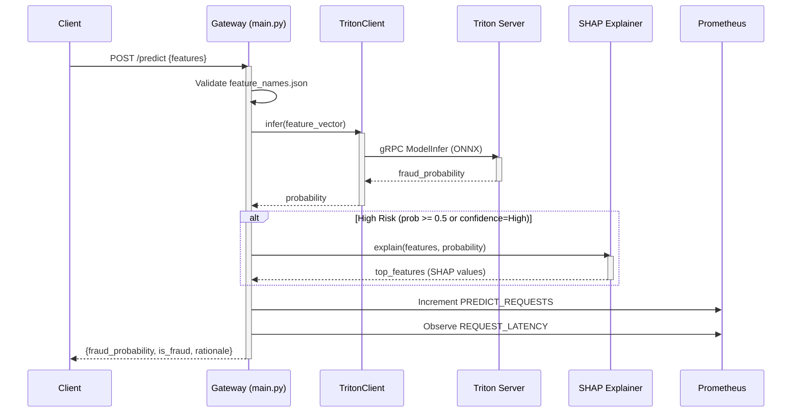

# System Blueprint: suryayalavarthi/Sentinel-Real-Time-Financial-Fraud-Detection-Engine

> 🛡️ High-frequency Fraud Detection Engine with real-time inference (6-8ms) and automated MLOps drift monitoring. $730K+ estimated annual ROI.
>
> Auto-generated on 2026-02-13 by Repo-to-Blueprint Architect

## Project Purpose
Real-time financial fraud detection engine processing transaction data with 6-8ms inference latency. Uses XGBoost models served via NVIDIA Triton, with SHAP-based explainability for high-risk predictions and streaming drift monitoring for production MLOps.

## Technical Stack
- **Language**: Python 3.11
- **Framework**: FastAPI (serving), XGBoost (ML), NVIDIA Triton Inference Server (model serving)
- **Key Dependencies**:
  - ML: `xgboost>=1.5.0`, `scikit-learn>=1.0.0`, `shap>=0.40.0`
  - Serving: `fastapi>=0.110.0`, `uvicorn>=0.27.0`, `tritonclient[grpc,http]>=2.34.0`
  - Quantization: `hummingbird-ml==0.4.12`, `onnx>=1.14.0`, `onnxruntime>=1.15.0`
  - Monitoring: `prometheus-client>=0.19.0`, `scipy>=1.7.0` (drift detection)
- **Infrastructure**: Docker (Dockerfile, Dockerfile.gateway, Dockerfile.triton), Docker Compose, GitHub Actions CI/CD, Prometheus, Grafana

## Architecture Blueprint

## Request Flow

## Evidence-Based Risks

1. **Hardcoded Threshold (0.5)**: `main.py:23` defines `THRESHOLD = 0.5` globally; no dynamic calibration mechanism found in codebase, limiting adaptability to evolving fraud patterns.

2. **Silent Fallback on Triton Failure**: `main.py:88-92` catches all exceptions during `TritonClient` initialization and sets `triton_client = None`, causing `/predict` endpoint to raise HTTP 500 (`main.py:135`) without retry logic or circuit breaker.

3. **Unbounded Drift Buffer**: `monitoring/drift.py` (referenced in `docker-compose.yml:67` and `main.py:96`) uses `buffer_size=10000` with no eviction policy visible in file tree; prolonged operation risks memory exhaustion.

4. **Missing Model Versioning**: `model_repository/sentinel_model/config.pbtxt` and `models/model_metadata.json` exist but no version control mechanism in `src/model_training.py` or deployment scripts; rollback requires manual file replacement.

5. **CI Model Generation Bypasses Validation**: `scripts/generate_ci_model.py` (used in `.github/workflows/smoke-test.yml:72`) creates minimal ONNX models for testing but smoke test doesn't validate prediction accuracy against known fraud cases, risking deployment of undertrained models.

---

## Repository Stats
| Metric | Value |
|--------|-------|
| Total Files | 57 |
| Total Directories | 13 |
| Generated | 2026-02-13 |
| Source | [suryayalavarthi/Sentinel-Real-Time-Financial-Fraud-Detection-Engine](https://github.com/suryayalavarthi/Sentinel-Real-Time-Financial-Fraud-Detection-Engine) |

---

*Generated by Repo-to-Blueprint Architect via n8n*
